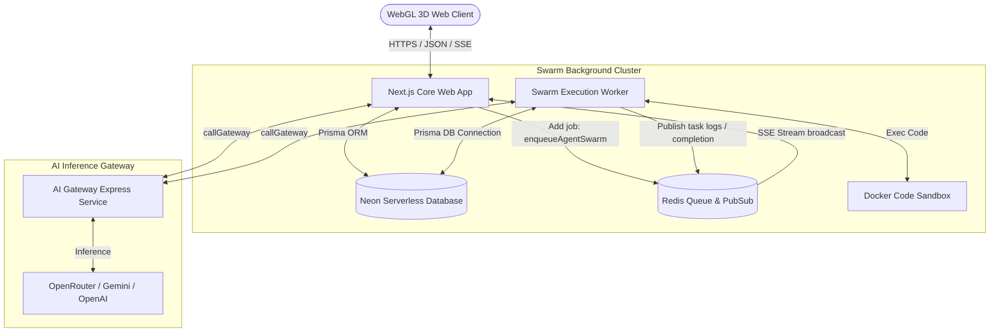

# AIVerse 2.0 — Unified Enterprise Architecture

This document describes the unified enterprise architecture of AIVerse 2.0. It maps the systems stack, directory structure, data flows, job queues, safety schemas, and the React Three Fiber (R3F) WebGL frontend.

---

## 🏛️ SYSTEM STACK & CORE GUIDELINES

AIVerse 2.0 is built on a decoupled, microservices-driven monorepo architecture:

1.  **Frontend (Next.js 15)**: Leverages React Server Components (RSC), App Router, dynamic scale normalization for 3D viewports, and Tailwind CSS v4.
2.  **Shared Storage & Cache**: PostgreSQL (Neon Serverless with pgvector and pg_trgm), managed via Prisma client; and Redis (ioredis) for cache, rate limiting, and Pub/Sub logs.
3.  **AI Gateway Service**: Standalone Express microservice handling safety filters, API key rotation, fallback models routing, and circuit breakers.
4.  **Swarm Background Worker**: Isolated BullMQ task runner running long-lived agent workflows, sandboxed executions, and dynamic step revisions.

---

## 🧱 SYSTEM COMPONENT TOPOLOGY



---

## 📂 MONOREPO DIRECTORY LAYOUT

```
/project/workspace
├── src/                          # Next.js 15 Source
│   ├── app/                      # Page Routes & Web API Endpoints
│   │   ├── agents/
│   │   │   ├── create/page.tsx   # Step-by-Step Agent wizard (with active tools configuration)
│   │   │   └── [slug]/
│   │   │       ├── edit/page.tsx # Agent management panel
│   │   │       └── page.tsx      # Agent detail and play screen (with tools list badges)
│   │   └── api/                  # Core App API routes (NextAuth, Checkout, execution triggers)
│   ├── components/               # React UI Library
│   │   ├── effects/
│   │   │   └── LiveTaskVisualizer3D.tsx # WebGL R3F task pipeline visualizer (with dynamic labels & spinning rings)
│   │   └── ui/                   # Shared UI primitives (Badge, Card, Button, Modal)
│   └── lib/                      # Validation schemas and utilities (validations.ts, prisma.ts)
│
├── services/
│   └── ai-gateway/               # AI Gateway Service
│       ├── src/                  # Circuit breakers, key rotators, and routing configurations
│       └── .env.example          # AI Gateway environment configurations
│
└── aiverse-swarm-service/        # Agent Swarm Background Worker
    ├── src/
    │   ├── swarm.ts              # Plan-Act-Observe-Reflect orchestrator and tools registry
    │   └── sandbox.ts            # Sandboxed container runners
    └── .env.example              # Swarm service standalone environment variables
```

---

## 🔄 DATA FLOORS & EVENT STREAMS

### 1. Web Execution Initiation
1. The user inputs a prompt and hits **Run Agent** inside the [AgentRunner](file:///project/workspace/src/components/agent/agent-runner.tsx) component.
2. The UI sends a `POST` request to `/api/agents/[slug]/execute` with the prompt.
3. If category is `WORKFLOW`, the server issues a job structure via `enqueueAgentSwarm()` to BullMQ inside [queue.ts](file:///project/workspace/src/lib/queue.ts).
4. The server returns a Server-Sent Events (SSE) readable stream response holding the unique BullMQ `sessionId` channel.

### 2. Autonomous Loop Execution (Swarm Worker)
1. The worker processes the job and queries database for the Agent details, including its **`toolsConfig`** settings.
2. The orchestrator prompts the AI Gateway to compile a Directed Acyclic Graph (DAG) plan of steps using *only* permitted tools.
3. The worker enters the plan-act-observe-reflect execution state:
   - Variable placeholders (e.g. `${task-1.output}`) are dynamically resolved.
   - Active tools are checked against `toolsConfig` before running.
   - Scripts are executed inside the secure isolated sandbox; web queries are fetched.
   - Dynamic reflection prompts are sent to re-evaluate plans and adapt if necessary.
4. Steps trace results are pushed via Redis Pub/Sub back to the Next.js server.
5. The final synthesized response is returned and saved, finishing the queue state.

---

## 🎨 PREMIUM 3D WEBGL GRAPHICS INTERFACE

The system features an interactive Three.js 3D task visualizer ([LiveTaskVisualizer3D.tsx](file:///project/workspace/src/components/effects/LiveTaskVisualizer3D.tsx)) displaying agent steps as a spiral helix tree:

- **Interactive Core Spheres**: Sized and colored dynamically based on node status (pending: indigo, running: pulsed blue, success: emerald, error: ruby red).
- **Dynamic 3D Typography**: Implements the Drei `<Text>` component to display floating title labels above each step, making the status readable in space.
- **Cybernetic Orbit Rings**: Renders spinning wireframe toruses around running cores, providing visual cues of background task activity.
- **Pulse Trace Lines**: LERPs glowing energy pulses along connection paths, tracing execution flow across node dependencies.
- **Aspect Scale Adaptation**: Implements viewport aspect monitoring, scaling WebGL elements to prevent clipping on mobile screens.
- **Non-blocking Controls**: Overrides orbit zoom and touch gestures to allow standard mouse wheel web scrolling.
