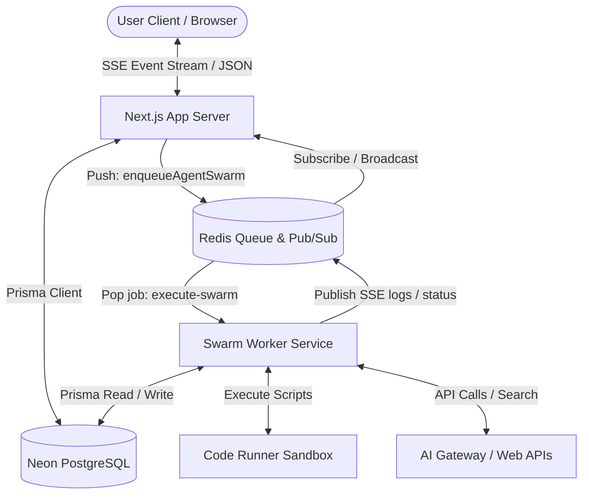
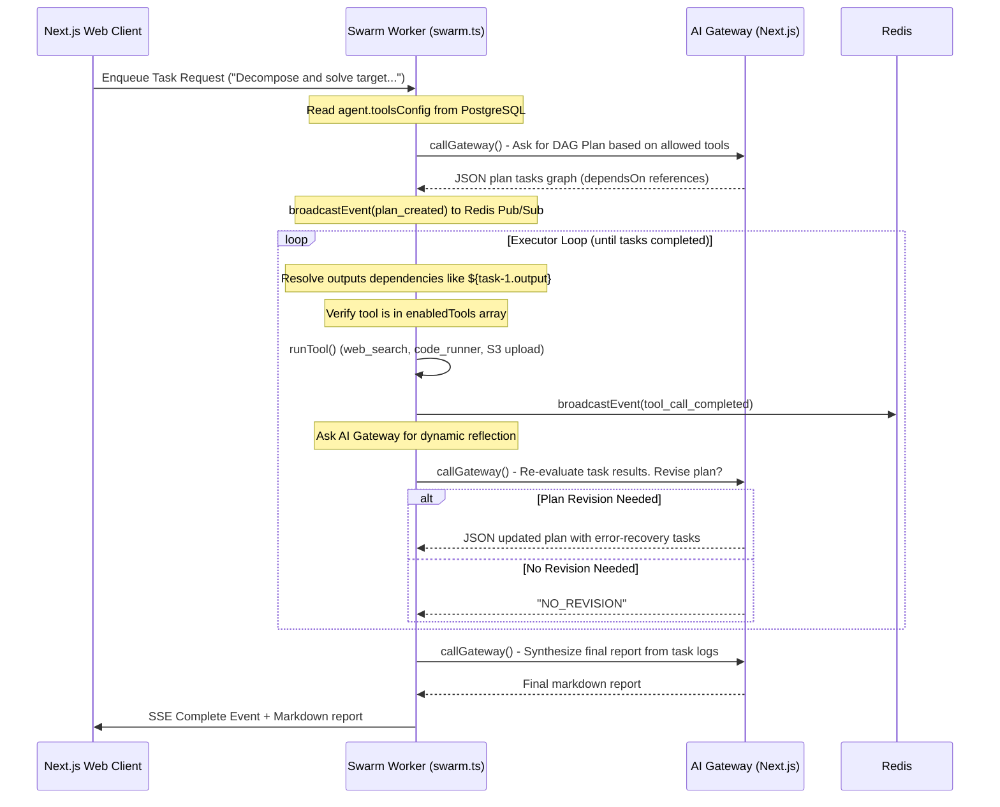

# AIVerse 2.0 — Agent Swarm & Tools Configuration Guide

This guide details the integration of the **Agent Swarm Execution Framework** and the **Dynamic Tools Configuration (`toolsConfig`)** within the AIVerse architecture. It explains how settings configured in the Next.js creator dashboard are enforced inside the worker service's plan-act-observe-reflect execution loop.

---

## 🧱 ARCHITECTURAL OVERVIEW

The agent swarm operates on a decoupled orchestrator-worker topology, using Redis for task dispatch and real-time Server-Sent Events (SSE) broadcasting, and PostgreSQL for state storage.



---

## ⚙️ DATABASE & VALIDATION SCHEMA

Agent tools configuration is defined under the `toolsConfig` database column as a JSON block.

### Schema Spec
In the `prisma/schema.prisma` file, `toolsConfig` is stored on the `Agent` and `AgentVersion` models:
```prisma
model Agent {
  id           String   @id @default(uuid())
  name         String
  slug         String   @unique
  category     AgentCategory
  toolsConfig  Json?    // Structured as { enabledTools: string[] }
  ...
}
```

### Zod Validation Schema (`src/lib/validations.ts`)
We parse and validate the tools parameter inside `createAgentSchema` and `updateAgentSchema`:
```typescript
export const createAgentSchema = z.object({
  name: z.string().min(1).max(200),
  category: z.enum(["CHAT", "CODE", "DATA", "WORKFLOW"]),
  systemPrompt: z.string().max(8000).optional().default(""),
  // Validation for dynamic toolsConfig mapping
  toolsConfig: z.record(z.string(), z.unknown()).optional().nullable(),
  ...
});
```

---

## 🖥️ WEB CREATOR CLIENT

Dynamic tools configuration is exposed to creators in both the Agent Publishing flow and the Agent Editing dashboard.

### 1. Publishing Wizard (`src/app/agents/create/page.tsx`)
In Step 2 of the creation wizard, the hardcoded "Coming Soon" placeholders are replaced with an interactive checkbox panel containing descriptions of the 7 default swarm tools:
- Checks are managed in client-side state under `enabledTools: Record<string, boolean>`.
- During submission, `toolsConfig` is compiled into the payload:
  ```json
  {
    "toolsConfig": {
      "enabledTools": ["web_search", "code_runner"]
    }
  }
  ```

### 2. Update Configuration (`src/app/agents/[slug]/edit/page.tsx`)
- Fetches the current configuration block from `/api/agents/[slug]` and initializes checkboxes accordingly.
- Appends current active tools in the `PATCH` body parameters upon form submission.

### 3. Badge Indicators (`src/app/agents/[slug]/page.tsx`)
- The agent detail view sidebar checks if the agent category is `WORKFLOW` and renders clean Badge tags mapping the active swarm capabilities.

---

## 🔄 THE SWARM ORCHESTRATION LOOP

When execution is started for a `WORKFLOW` category agent, the system spawns a dynamic **Plan-Act-Observe-Reflect** loop:



---

## 🛠️ SWARM TOOLS REGISTRY

All executable tools are registered inside `aiverse-swarm-service/src/swarm.ts`.

### 1. Tool Catalog
| Tool ID | Parameters | Description |
| :--- | :--- | :--- |
| `web_search` | `{ query: string }` | Performs simulated google search using the AI Gateway. |
| `web_fetch` | `{ url: string }` | Fetches raw HTML/text payload from external web resource. |
| `code_runner` | `{ code: string }` | Evaluates Python/JS/TS scripts securely in container sandbox. |
| `file_write_s3` | `{ fileName: string, content: string }` | Uploads content to S3-compatible cloud storage buckets. |
| `file_read_s3` | `{ key: string }` | Retrieves file content from storage reference key. |
| `db_query` | `{ table: string, operation: string, filter: object }` | Queries read-only scoped tables (`Agent`, `AgentExecution`, `User`). |
| `subagent_dispatch`| `{ prompt: string, agentRole: string }` | Delegates sub-goals to virtual helper agent roles. |

### 2. Runtime Enforcer & Security Check
Prior to executing a step, the worker performs a strict safety check against the loaded configuration list:
```typescript
// Runtime toolsConfig safety check
if (!enabledTools.includes(step.tool)) {
  throw new Error(`Tool "${step.tool}" is not enabled for this agent. Enabled tools: ${enabledTools.join(", ")}`);
}
```

---

## 🧪 DEVELOPER TEST PROCEDURE

### 1. Build and Compile
Verify compiler checks pass clean:
```bash
# Next.js workspace check
pnpm typecheck

# Swarm worker compilation
cd aiverse-swarm-service
npm run build
```

### 2. Run Local Environment
Start redis and services:
```bash
# Start backend swarm worker watchers
cd aiverse-swarm-service
npm run dev

# Start local Next.js client
pnpm dev
```
Now, configure a `WORKFLOW` agent, select `Web Search` and `Code Sandbox Runner`, write a task prompt, and click **Run Sandbox Test** in the submission stage to observe real-time step streams.
